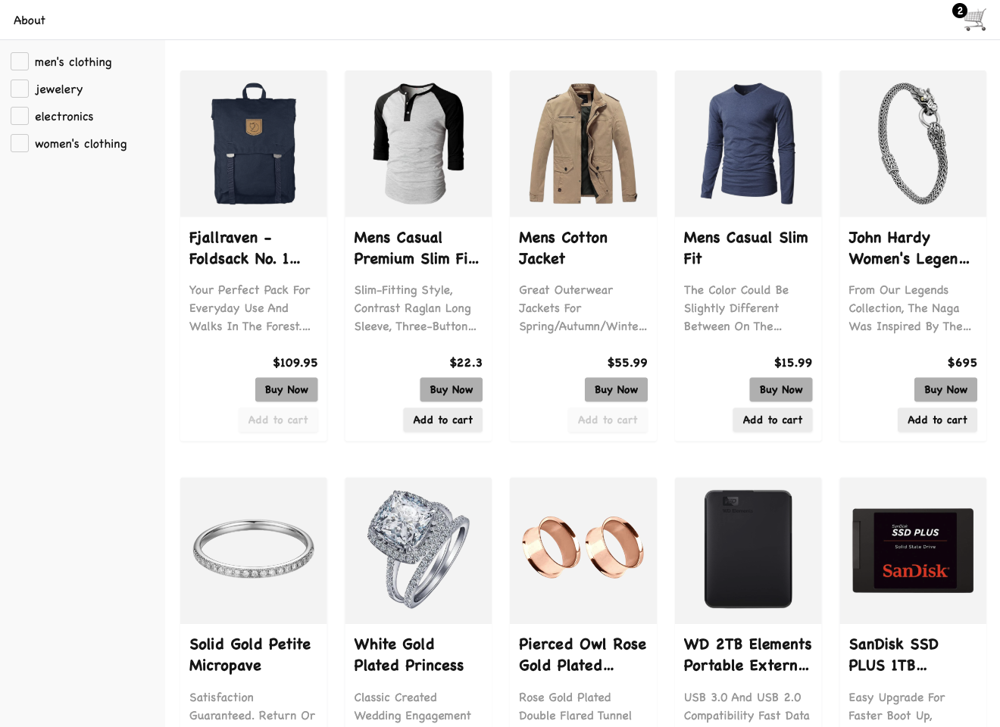

# Vanilla JS E-commerce

A simple e-commerce application built with **vanilla JavaScript**, focused on
practice and maintaining core JavaScript skills.

This project is not intended to introduce new concepts or solve complex
problems. Everything used here is already familiar to me, and the main goal is
to stay fluent in JavaScript fundamentals by building a complete, real-world
style application without front-end frameworks.

<details>
<summary>📸 View Screenshot</summary>



</details>

---

## About the Project

This is a small e-commerce app built from scratch using plain JavaScript and
server-side routing with Express.js. It includes common features found in
typical online stores and serves as a practical way to keep existing skills
sharp.

The UI is styled using **Tailwind CSS** and **DaisyUI**, while all client-side
logic, state handling, and interactions are implemented with vanilla JavaScript.

Product data is fetched from [Fake Store API](https://fakestoreapi.com/).

---

## Features

- Product listing with category-based filtering
- Dynamic product detail pages
- Shopping cart functionality
- Checkout page with:
  - Total items count
  - Total price calculation
- Server-side routing using Express.js
- Responsive layout (mobile & desktop)
- Unit and integration tests

---

## Project Structure

```
src/
├── routes/          # Client-facing pages and route files
├── scripts/         # Vanilla JavaScript logic
└── styles/          # Styles (Tailwind / custom CSS)
```

---

## Tech Stack

- **Vanilla JavaScript**
- **Express.js**
- **Tailwind CSS**
- **DaisyUI (v4)**
- **HTML**
- **CSS**
- **Vitest** (unit & integration testing)

---

## Project Goals

- Practice JavaScript without frameworks
- Avoid abstraction-heavy solutions
- Reinforce fundamentals through repetition
- Maintain fluency by building complete flows:
  - Listing → Details → Cart → Checkout

---

## Getting Started

1. Install dependencies:

   ```bash
   npm install
   ```

2. Start the development server:

   ```bash
   npm run dev
   ```

3. Open the app in your browser:
   ```
   http://localhost:8080
   ```
